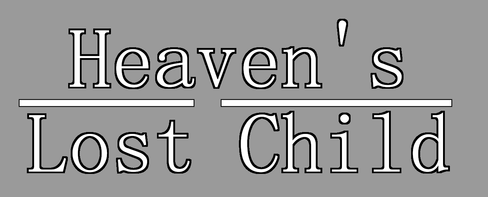

# Heaven's Lost Child: A Game in The Celeste 64 Engine

    

Heaven's Lost Child is a game utilizing the engine of <b>Celeste 64: Fragments of the Mountain</b>, a game made by the original Celeste developers in under 2 weeks for Celeste's 6th Anniversary. It is forked from the source code of that game, and the mod loader Fuji.

### [Celeste 64 can be found here](https://github.com/ExOK/Celeste64)
### [Fuji Mod Loader can be found here](https://github.com/FujiAPI/Fuji)

# License
 - The Celeste IP and everything* in the `Content` folder are owned by [Maddy Makes Games, Inc](https://www.maddymakesgames.com/).
 - The `Source` folder, with exceptions where noted, is [licensed under MIT](Source/License.txt).
 - The `Source/Audio/FMOD` folder contains bindings and binaries from FMOD.
 - This game is adapted from Fuji's Source code, which itself is adapted from Celeste 64's Source Code. neither are made nor endorsed by the game's creators. 
